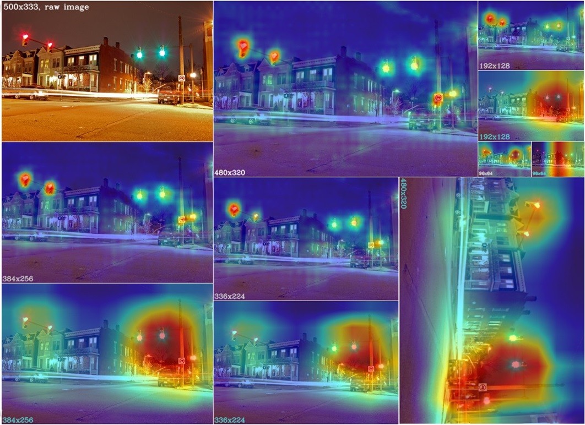
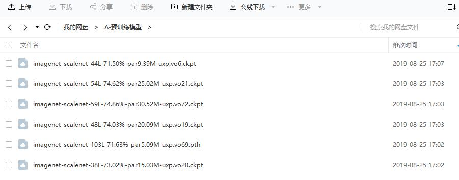

# Update Logs

- 2019-9-12  Add different up-/down-sampling methods to ScaleNet. 在ScaleNet上增加不同上采样/下采样方法的对比.

- 2019-9-19  Add a new CNN  model named `WaveNet`, which combines `Conv-DeConv` couple with DenseNet architecture. ... ... 
  增加新模型 WaveNet, 将`Conv-DeConv`结构与DeseNet结构相结合.


# ScaleNet Architecture


# CAM Camparision of ScaleNet & DenseNet

#### *`top-line: scalenet  bottom-line:densenet`*

#### *`top-WhiteFont: scalenet  bottom-CyanFont:densenet`*

# Requirements

Pytorch >= 0.4

TensorboardX

# How to Train ScaleNet

model architecture params are in folder: ./arch_params

model training configs are in folder: ./cfg_params 

for example, when trainining ImageNet, net1 = 'vo21 || vo69 || vo72 || vo76',  
check './arch_params/scalenet_imagenet_params.py'

data root, checkpoints path, tensorboard-logs-path are in xxxmodel_xxxdata_cfg.py  

## Train by Terminal Commands

Entry function is 'run_main.py'.

It can be used as following:

```
cd /to/your/project/root

# 
python run_main.py -name 'scalenet' -arch 'net1' -cfg 'cfgnet1' -exp 'exp.net1' -gpu 1 3

# also can run by nohup to save logs into a file
nohup python run_main.py -name 'scalenet' -arch 'net1' -cfg 'cfgnet1' -exp 'exp.net1' -gpu 1 3 1>printlog/net1.out 2>&1 &

```

## Train by Pycharm Client
Find the following lines in 'run_main.py', and remove the comments on these lines.
Then run this file in Pycharm.
```
args.arch_name = 'scalenet'
args.arch_list = ['net1']
args.cfg_dict = 'cfgnet1'
args.exp_version = 'exp.net1'
args.gpu_ids = [0, 1, 2, 3, 5, 6]
print('\n=> Your Args is :', args, '\n')
```

# Pre-trained Models on ImageNet


BaiduYunPan: https://pan.baidu.com/s/1EbLnt0X-nIndwRlh6zNN8Q   key：9qpg 

GoogleDrive: uploading ... coming soon!


# Other Features

- Unified Training Framework for Classification.

- Unified Data Factory, including CIFAR, IMAGENET, SVHN, LSV etc..

- Unified Model Factory, including Pytorch-official models and New Models in 2019.  

- Including New Models in 2019: ScaleNet, EfficientNet, MobieNet-V3, HighResolutionNet etc..

